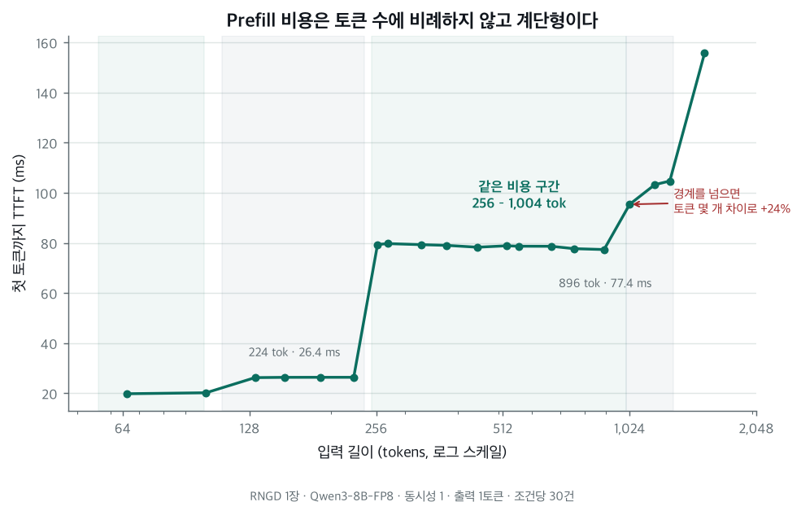
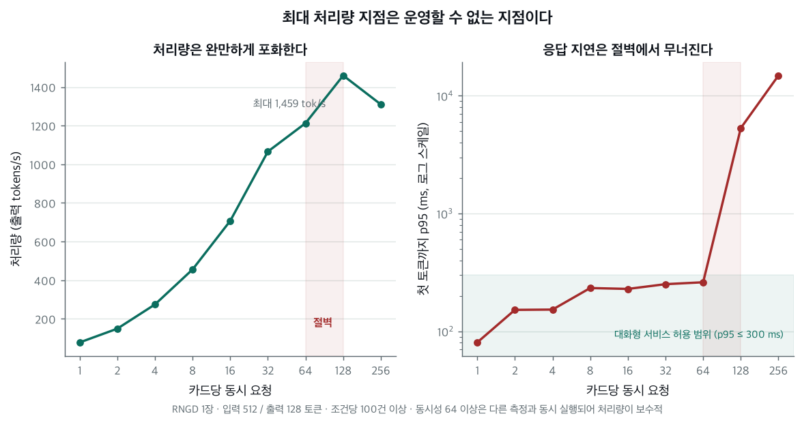
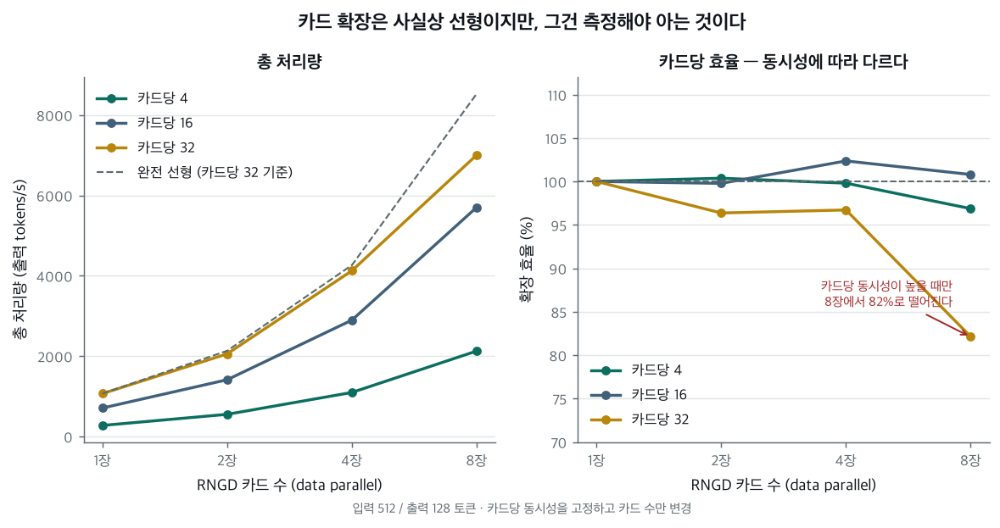

# rngd-workload-sizer

FuriosaAI RNGD NPU에서 실제 추론 워크로드를 측정하고, 그 실측값으로 **"이 서비스에 RNGD 몇 장이 필요한가"**에 답하는 도구입니다.

---

## 문제

서비스를 설계할 때 이런 질문을 받습니다.

> 동시 사용자 1,000명, 평균 입력 512토큰, 출력 128토큰, 첫 응답 1.5초 이내. NPU 몇 장이 필요한가?

카탈로그의 peak TOPS로는 답할 수 없습니다. 실제로 측정해보면 **용량을 결정하는 것이 연산 성능이 아니기 때문**입니다.

### 실측으로 확인한 세 가지

**1. Prefill 비용은 토큰 수에 비례하지 않고 계단형입니다.**

RNGD는 컴파일된 shape 단위로 실행됩니다. 입력 길이를 64토큰부터 촘촘히 훑은 결과:

| 입력 길이 | 첫 토큰까지(TTFT) |
|---|---|
| 64 – 96 | ~20 ms |
| 128 – 224 | ~26 ms |
| **257 – 1,024** | **~78 ms** |
| 1,025 – 1,280 | ~95–105 ms |
| **1,281 –** | **~160 ms** |

**257토큰과 1,024토큰의 prefill 비용이 같습니다.** 4배의 길이 범위가 동일 비용입니다. 프롬프트가 300토큰이라면 few-shot 예시나 RAG 문맥을 **724토큰 더 붙여도 TTFT가 늘지 않습니다.**

반대로 경계를 넘으면 토큰 몇 개 차이로 비용이 뜁니다. 단일 토큰 해상도로 보면 1,024토큰이 77.58 ms, **1,025토큰이 96.76 ms** 입니다 — **+25%**.

계단은 **128/129 · 256/257 · 1,024/1,025 · 1,280/1,281** 네 곳에만 있습니다. 아티팩트에 선언된 버킷은 8개(128·256·384·512·640·768·896·1,024)인데, 384·768·896 주변은 실측 변동이 ±0.3%로 평탄합니다. **선언된 버킷과 실제 비용 경계가 다릅니다.** 반대로 1,280은 +55% 계단인데 선언 목록에 없습니다.



FLOPS 계산으로는 이 계단이 보이지 않습니다.

**2. 처리량을 올리는 대가는 첫 응답이 아니라 사용자당 생성 속도입니다.**

RNGD 1장에서 동시 요청을 늘려가며 측정한 결과:

| 동시 요청 | 처리량 | 첫 토큰까지 p95 | 사용자당 생성 속도 |
|---:|---:|---:|---:|
| 32 | 1,066 tok/s | 240 ms | 33.8 tok/s |
| 64 | 1,213 tok/s | 261 ms | 19.5 tok/s |
| **128** | **1,459 tok/s** | **285 ms** | **12.7 tok/s** |
| 256 | 1,310 tok/s ↓ | **9,116 ms** | 5.5 tok/s |

**첫 토큰까지는 128까지 거의 평탄합니다** (240 → 285 ms). 대신 동시성을 2배로 올릴 때마다
사용자당 생성 속도가 절반씩 떨어집니다. 즉 **대화형 서비스에서 먼저 걸리는 것은
"응답이 시작되는 속도" 가 아니라 "응답이 흘러나오는 속도"** 입니다.

절벽은 **128과 256 사이**에 있습니다. 256에서는 첫 응답이 32배 나빠지면서
처리량마저 떨어집니다 — 모든 면에서 열등하므로 운영점 후보가 아닙니다.



> ⚠️ 이 표의 conc 64·128·256 값은 **다른 측정과 동시에 실행된 것**이고,
> 128·256은 warm-up 부족을 사후 보정(앞 구간 제외)해 얻은 값입니다.
> 다음 세션에서 단독·정상 warm-up 으로 재측정할 항목입니다.

즉 **"최대 처리량 ÷ 사용자당 필요량"으로 계산하면 실제로는 못 쓰는 숫자가 나옵니다.**
용량은 SLA를 지키는 지점에서 세야 합니다.

**3. 카드를 N장 쓰면 성능도 N배라는 가정은 검증해야 합니다.**

이건 측정해보니 사실이었지만, 미리 알 수 있는 것은 아니었습니다. 카드를 늘리면 라우팅 오버헤드와 카드당 배치 감소가 동시에 일어나기 때문입니다.

| 카드당 동시성 | 2장 | 4장 | 8장 |
|---:|---:|---:|---:|
| 4 | 100.4% | 99.8% | 96.9% |
| 16 | 99.8% | 102.4% | 100.8% |
| 32 | 96.4% | 96.7% | **82.1%** |



중간 동시성에서는 8장까지 사실상 선형입니다. 카드당 동시성이 높을 때만 8장에서 82%로 떨어집니다. **효율이 카드 수만이 아니라 카드당 동시성에도 의존한다**는 것이 이 표의 요점입니다.

---

## 무엇을 만들었나

```
측정 하네스  →  실측 데이터  →  분석  →  용량 산정기  →  UI
benchmark/      data/          analysis/  planner/       app/
```

세 부분이 **완전히 분리**돼 있습니다. 측정은 계산을 모르고, 계산은 화면을 모릅니다. 실측 데이터가 유일한 인터페이스이므로, RNGD가 없어도 저장소를 받아 계산과 그래프를 그대로 재현할 수 있습니다.

| | |
|---|---|
| `benchmark/` | 측정 하네스. 표준 라이브러리만 사용 |
| `analysis/` | raw 측정 → 집계 테이블·확장 효율 |
| `planner/` | 용량 산정. 순수 함수, UI 의존 없음 |
| `app/` | Streamlit UI |
| `data/raw/` | 요청별 원본 (JSONL) |
| `docs/` | 환경 조사·기획 검토·측정 프로그램·세션 로그 |

---

## 어떻게 측정했나

측정이 이 프로젝트의 핵심입니다. **틀린 측정은 그럴듯한 숫자를 내기 때문에** 하네스가 스스로 신뢰도를 검증합니다.

### 측정 환경

| | |
|---|---|
| 하드웨어 | RNGD 8장, firmware `2026.3.0` |
| **1 RNGD 정의** | `--devices npu:X` = 카드 1장 = **PE 8개 전체** (TP=8) |
| SDK | `furiosa-llm 2026.3.0` |
| 모델 | `furiosa-ai/Qwen3-8B-FP8` |
| API 경로 | `/v1/completions` (chat 아님) |

### 측정 조건 통제

| 통제 | 이유 |
|---|---|
| `--no-enable-prefix-caching` | **기본값이 ON**이라 반복 측정이 오염됩니다 (아래 참조) |
| 요청마다 고유 난수 프롬프트 | 캐시 적중을 막습니다 |
| `/tokenize`로 길이 보정 | 문자 수 어림 금지. 서버 토크나이저 기준으로 목표 길이에 수렴시킵니다 |
| `ignore_eos` + `min_tokens` | 출력 길이를 정확히 고정. EOS가 들쭉날쭉하면 TPOT 비교가 무의미합니다 |
| 조건당 100건 이상 | 미달이면 P95를 내지 않고 `insufficient_samples`로 표기 |

### 지표 정의

```
TTFT = 첫 non-empty 토큰 delta 수신 시각 − 요청 전송 시각
E2E  = 마지막 delta 수신 시각 − 요청 전송 시각
TPOT = (E2E − TTFT) / (출력 토큰 수 − 1)

처리량 = Σ(측정 요청의 출력 토큰) / 측정 구간 wall-clock
```

wall-clock 기반 처리량과 요청별 지연을 **섞지 않습니다.**

동시성 N은 "N개를 보내고 다 끝나기를 기다린다"가 아니라 **"항상 N개가 처리 중"**입니다. 워커가 요청을 끝내면 곧바로 다음을 보냅니다. 앞의 방식은 매 배치 끝에서 동시성이 줄어 처리량을 과소평가합니다.

> ⚠️ **`content`만 보면 안 됩니다.** Qwen3·gpt-oss 같은 추론 모델은 `content`가 끝까지 빈 채 `reasoning` delta로만 토큰을 냅니다. 원래 정의를 그대로 썼다면 이런 모델에서 TTFT가 **영원히 측정되지 않았을 것**이고, 에러도 나지 않았을 것입니다.

### 자기검증

측정 조건마다 결과를 믿어도 되는지 점검하고 `summary.json`에 남깁니다. **검증에 실패해도 값을 지우지 않고 표시만 합니다.**

| 항목 | 확인 |
|---|---|
| prefix cache 오염 | 프롬프트 중 캐시에서 나온 **비율** (5% 초과 시 오염) |
| 출력 길이 | `ignore_eos`가 실제로 먹었는가 |
| 입력 길이 | 의도한 길이와의 편차 |
| 실제 동시성 | `/metrics`의 `running_samples` — 배칭인가 큐잉인가 |
| 재시도 | 커넥션 재수립이 지연에 영향을 줬는가 |
| 표본 수 | P95를 낼 수 있는가 |
| 출처 | 전용 서버 실측인가 |

**검증 결과는 두 갈래로 쓰입니다.** 하나로 묶으면 어느 값이 왜 못 쓰는지를 잃습니다.

| 판정 | 어떻게 되는가 |
|---|---|
| prefix cache 오염 · 출력 길이 미고정 · 출처 비실측 | **조건 자체가 무효.** 집계 테이블에는 남지만 planner 가 로드 단계에서 거부하고, 사유를 결과 경고에 그대로 싣습니다 |
| warm-up 부족 · 짧은 측정창 · 큐잉 · 재시도 | 버리지 않고 **근거 선택 순위**로 씁니다. warm-up 부족은 지연 백분위만 망가뜨리고 처리량은 멀쩡합니다 — metric 마다 영향 방향이 다릅니다 |

---

## 측정이 틀렸던 여섯 가지 — 그리고 셋은 원인까지 틀렸습니다

이 프로젝트에서 가장 시간을 쓴 부분입니다. 여섯 다 **그럴듯한 숫자를 냈기 때문에** 두 번 재보지 않았다면 그대로 결론이 됐을 것들입니다.

그리고 더 중요한 것이 있습니다. **한동안 이 절에는 네 항목이 있었고, 그중 셋은 관측은 맞는데 원인 지목이 틀렸습니다.** 두 번째 측정 세션에서 통제 실험으로 갈랐더니 서로 다른 세 현상이라고 적어둔 것 중 둘이 같은 원인이었고, 그 원인은 우리가 지목한 것이 아니었습니다.

> **이 절의 정정은 세 쪽이 서로를 고친 결과입니다.** 진행 세션(코드를 쓴 쪽)·검증 세션(같은 데이터를 독립 재계산한 쪽)·Codex(맥락 없이 원본만 받은 쪽) 셋이 서로의 결론을 뒤집었습니다. 방향은 한쪽이 아니었습니다 — Codex 가 두 세션의 서사 오귀속을 잡았고, 검증 세션이 진행 세션의 코드 결함을 잡았고, 진행 세션의 실측이 검증 세션의 잘못된 일반화를 두 번 뒤집었습니다.

### 1. prefix cache가 긴 문맥에서 prefill을 최대 21배 과소평가

> 여섯 중 **처음부터 원인을 맞게 지목한 유일한 항목**입니다.

같은 프롬프트를 반복 측정하면 2회차부터 캐시가 적중합니다. 서버 기본값이 ON입니다.

| 프롬프트 토큰 | 같은 프롬프트 반복 | 매번 다른 프롬프트 | 과소평가 |
|---:|---:|---:|---:|
| ~1,000 | 55 ms | 163 ms | 3.0× |
| ~4,800 | 90 ms | 653 ms | 7.3× |
| ~19,300 | 166 ms | 3,464 ms | **20.9×** |

무서운 점은 **"여러 번 재서 중앙값을 쓴다"는 신뢰성 장치가 오히려 편향을 키운다**는 것입니다. 반복할수록 캐시가 더 잘 맞습니다.

→ 캐시 OFF + 요청별 고유 프롬프트 + 적중 비율 기록. 비율이 5%를 넘은 조건은 **planner 로드 단계에서 거부**되고 사유가 결과에 표시됩니다. 기록만 남기고 아무도 읽지 않으면 방어가 아닙니다 — 실제로 한동안 그 상태였습니다(교차검증 X9).

### 2. warm-up 이 동시성보다 적으면 지연 백분위가 최대 14배 부풀려진다

처음에는 원인을 **측정창 길이**로 봤습니다. 같은 조건을 두 번 잰 결과가 이랬기 때문입니다.

| 측정 요청 | 측정창 | 처리량 | TTFT p95 |
|---:|---:|---:|---:|
| 100건 | 13.7 s | 936.8 tok/s | **1,437 ms** |
| 500건 | 60.0 s | 1,065.9 tok/s | **252 ms** |

**틀린 진단이었습니다.** 창 길이는 대리지표였습니다.

진짜 원인은 **warm-up 요청 수가 동시성보다 적은 것**입니다. 워커가 N개인데 warm-up 이
M건(M<N)이면 워커 N−M 개의 **첫 요청이 측정에 들어옵니다.** 그 요청들은 큐가 형성되는
동안 대기하므로 지연이 부풀려집니다. 그리고 그 수는 **고정(=동시성)** 이라, 오래 측정하면
줄어드는 게 아니라 **희석될 뿐**입니다.

| 조건 | warm-up | 동시성 | 앞 N건 중앙값 | 이후 중앙값 | 배율 |
|---|---:|---:|---:|---:|---:|
| C2x2 | 16 | 8 | 151.7 ms | 150.2 ms | 1.0× |
| C1x8b | 32 | 32 | 163.7 ms | 149.0 ms | 1.1× |
| B1hi | 64 | 64 | 253.9 ms | 173.9 ms | 1.5× |
| C2x1 | **8** | **32** | 853.3 ms | 159.1 ms | **5.4×** |
| B1hi | **64** | **128** | 3,774.9 ms | 267.3 ms | **14.1×** |

warm-up ≥ 동시성이면 1.0–1.5배, 미달이면 5–14배로 완전히 갈립니다.

**결정적 검증** — B1 conc=32 (warm-up 8, 측정 100건). 부풀려진 앞 32건이 표본의 32%라
p95 상위 5%를 통째로 지배합니다.

```
전체 100건        p95 = 1,437 ms
앞  8건 제외      p95 = 1,520 ms   ← 안 됨
앞 16건 제외      p95 = 1,520 ms   ← 안 됨
앞 32건 제외      p95 =   247 ms   ← 정확히 동시성만큼
독립 측정(참값)   p95 =   252 ms
```

**정확히 동시성만큼** 빼야 복원됩니다. 이게 원인을 특정하는 증거입니다.

→ 세 가지를 고쳤습니다.
> - 하네스가 `warmup_requests < concurrency` 면 **자동으로 동시성까지 올립니다.**
>   "더 오래 측정" 보다 싸고, 측정 시간이 오히려 줄어듭니다
> - 기존 데이터는 **앞 동시성만큼을 제외해 백분위를 다시 계산**합니다 (재측정 불필요).
>   23개 조건이 복구됐고, 그중 conc=128 은 TTFT p95 5,324 ms → **285 ms** 로 바뀌었습니다
> - 근거 선택 기준을 "측정창 15초" 에서 **"warm-up ≥ 동시성 그리고 표본 ≥ 동시성×20"**
>   으로 바꿨습니다. 창 길이는 처리량 판정에만 씁니다

이 항목은 **교차검증 세션이 잡아낸 것**입니다. 상관을 원인으로 읽고 있었습니다.

**적용 범위 — 보정이 만능이 아닙니다.**

두 번째 세션에서 같은 조건을 warm-up 을 제대로 주고 다시 쟀더니, 입력 512 에서는 보정값과 재측정값이 소수점까지 맞았습니다.

| 동시성 | 보정으로 복원한 값 | 독립 재측정 | 차이 |
|---:|---:|---:|---:|
| 64 | 261.1 ms | 260 ms | 0.4% |
| 128 | 284.8 ms | 287 ms | 0.8% |
| 256 | 9,115.6 ms | 9,115 ms | 0.01% |

**그런데 긴 입력에서는 복원되지 않았습니다.** `in=1024 conc=64` 는 보정을 거쳤는데도 6,226 ms 였고, 재측정값은 **390 ms** 입니다.

이유는 **창 길이가 아니라 표본 깊이**입니다. 앞 동시성만큼을 빼려면 **빼고 나서도 정상상태 표본이 남아야** 합니다. 그 조건은 100건에서 64건을 빼면 36건이 남습니다 — p95 를 낼 표본이 아닙니다. 하네스의 가드(`남은 표본 > 동시성 × 2`)가 정상 동작해 보정을 **포기**했고, 그래서 부풀어 있는 원본 값이 그대로 남았습니다.

긴 입력은 요청 하나가 오래 걸려 **같은 창 길이라도 표본이 얕습니다.** 그래서 입력 512 에서 통하던 보정이 입력 1024 에서 안 통했습니다.

→ 보정 조건을 `warm-up < 동시성` **하나에서** `그리고 제외 후 표본이 충분할 것` **둘로** 바꿨습니다. 보정을 포기한 행은 `percentile_source: summary` 로 남고, 그 행이 근거에 들어가면 결과에 경고가 붙습니다.

### 3. 같은 카드를 두 클라이언트가 나눠 쓰면, 라벨과 실제 동시성이 달라집니다

**이 항목이 예전에는 두 개였습니다.** "다른 측정과 동시에 돌면 부하 생성기가 호스트 자원을 나눠 쓴다(−26%)" 와 "`furiosa-smi` 폴링이 decode 를 33% 느리게 한다" 로 적어뒀는데, **둘 다 원인 지목이 틀렸고 진짜 원인은 하나였습니다.**

35분 지속 부하 중 26분 지점에서 처리량이 470 → 690 tok/s 로 뛰었습니다. 그 시각이 백그라운드에 남아 있던 폴링 루프의 마지막 샘플과 **초 단위로 일치**해서 폴링을 원인으로 적었습니다.

**실제로는 같은 카드에 클라이언트가 둘 붙어 있었습니다.** 두 soak 측정의 `meta.json` 이 같은 포트·같은 카드(`npu:6`, `:8000`)를 가리킵니다. 겹친 26분 동안 그 카드는 동시성 16 이 아니라 **32** 를 받고 있었습니다.

**통제 실험으로 갈랐습니다.** 창·표본·동시성을 모두 맞추고 한 변수만 바꿨습니다.

| | 처리량 | TPOT p50 | TTFT p50 |
|---|---:|---:|---:|
| 단독 · 폴러 0개 | 702.2 tok/s | 21.8 ms | 154.1 ms |
| 단독 · **폴러 2개** | 698.7 tok/s | **21.9 ms** | 154.8 ms |
| **같은 카드에 클라이언트 2개** · 폴러 0개 | 477.8 + 481.2 | **32.7 ms** | 159.5 / 159.0 ms |

**폴러를 2개 띄워도 0.5% 입니다.** TTFT p95 는 158 ms 로 소수점까지 같습니다. 반면 클라이언트를 하나 더 붙이면 TPOT 가 21.8 → 32.7 ms 로 갑니다 — soak 에서 관측한 그 33% 입니다.

그리고 재현값이 원본과 1% 안에서 맞습니다. soak 의 동시 구간은 각 476 tok/s · TPOT 32.76 / 32.74 였고, 통제 재현은 **477.8 / 481.2 · 32.7 / 32.7** 입니다.

**"호스트 자원 경합" 도 같이 무너집니다.** 부하 생성 프로세스가 셋 돌던 시점에 다른 카드에서 측정한 값(1,212.7 tok/s)과, 완전 단독으로 재측정한 값(**1,212.8**)이 **0.01% 차이**입니다. 128코어 머신에서 부하 4% 였으니 애초에 경합이 날 자리가 아니었습니다.

**왜 못 잡았나 — 신호는 데이터에 이미 있었습니다.**

`/metrics` 는 **서버 전체** 값을 냅니다. 그래서 두 soak 행에는 `requested=16, peak_running=32` 가 처음부터 기록돼 있었습니다. 그런데 판정식이 **하한만** 봤습니다.

```python
"verdict": "ok" if running >= spec.concurrency * 0.8 else "QUEUED_NOT_BATCHED"
```

`32 >= 16 * 0.8` 이라 통과입니다. **상한 검사가 없어서 "요청보다 많이 돌고 있다" 를 정상으로 판정했습니다.**

→ 상한을 넣었습니다. `running > 요청 × 1.25` 면 `FOREIGN_LOAD` 로 표시하고 **capacity 계산에서 자동 제외**합니다. 임계값은 실측 분포에서 뽑았습니다 — 비율이 1.05~1.20 인 조건이 0건이고 0.8~1.05 에 58건, 1.2 이상에 11건으로 깨끗하게 갈립니다.

이 검사가 세션 1 에 있었으면 soak 두 건이 즉시 걸렸고 폴링 오귀속은 애초에 안 쓰였을 것입니다. 두 번째 세션에서 일부러 같은 카드에 클라이언트 둘을 붙여 보니 **양쪽 모두** 잡혔습니다.

### 4. 측정 창이 짧으면 과도 구간만 재게 됩니다

처리량이 run 안에서 **시간에 따라 떨어집니다.** 첫 2~3분에 걸쳐 하강하고 그 뒤 평탄해집니다.

| 구간 | 처리량 | TPOT p50 |
|---|---:|---:|
| 0–60 s | 1,024 tok/s | 28.8 ms |
| 60–120 s | 986 | 31.2 |
| 120–180 s | 956 | 32.3 |
| 180–300 s | 943 | 32.7 |

동시성에 따라 폭이 다릅니다 — 동시성 32 에서 −9.9%, 16 에서 −2.2% 입니다. **기전은 모릅니다.** 열이 가장 그럴듯하지만 온도 시계열을 그 조건에서 남기지 않았습니다.

그래서 **같은 카드·같은 조건인데 창 길이가 다르면 값이 다릅니다.**

```
창  60초 (세션 1)   1,065.9 tok/s      ← 과도 구간만 잼
창 345초 (세션 2)     974.9 tok/s      ← 과도 + 평탄
정상상태                948 tok/s
```

한동안 이 차이를 **카드 차이**로 의심했습니다. 두 측정이 서로 다른 카드(`npu:6` vs `npu:0`)에서 나왔고, 유휴·부하 모두 `npu:6` 이 8장 중 가장 차가웠기 때문입니다. **같은 카드에서 다시 재서 갈랐습니다** — `npu:6` 의 오늘 값은 971.4 로 `npu:0` 의 세 측정(974.9 / 966.0 / 969.5)과 **0.36% 안**입니다. 카드 차이가 아니라 **세션 사이에 창 길이가 달랐던 것**입니다.

→ 같은 조건을 같은 카드에서 3회 반복해 **run 간 산포를 0.92%** 로 확정했습니다. 이제 어떤 차이가 유의미한지 판정할 수 있습니다. 그리고 확장 비교에는 **창 120초 이상**을 요구합니다 — 과도 구간 길이에서 뽑은 값입니다.

> **폴링 비용 0.5% 가 이 산포와 같은 크기입니다.** 3번 항목의 반증이 "구분 불가" 가 아니라 "산포 안" 이라고 말할 수 있는 근거입니다.

### 5. 파이프가 안 찬 측정을 "카드가 느리다" 로 읽었습니다

확장 효율은 `n장 처리량 / (1장 처리량 × n)` 입니다. 분모가 **명목** 동시성 기준이라, 창 동안 실제로 몇 개가 떠 있었는지는 아무도 안 봤습니다.

`peak_running` 은 **"목표에 한 번 닿았다"** 를 말하지 **"유지했다"** 를 말하지 않습니다. 실제로 `B1 conc=32` 는 `peak_running = 32.0` 에 판정이 `ok` 인데 평균 in-flight 는 **27.05** 였습니다 — 창의 상당 부분을 파이프가 덜 찬 채로 보냈는데 검증은 통과했습니다.

요청별 e2e 를 창으로 나누면 실제 평균 동시성이 나옵니다 (`Σ(e2e초) / 창초`). 세션 1 을 그렇게 보니:

| | 카드 수 | 총 동시성 | 창 | 유지율 |
|---|---:|---:|---:|---:|
| 1장 기준선 | 1 | 32 | 60.0 s | 97.6% |
| 2장 | 2 | 64 | 37.4 s | 94.9% |
| 4장 | 4 | 128 | 27.9 s | 91.8% |
| 8장 | 8 | 256 | **14.6 s** | **85.6%** |

**카드가 늘수록 같은 요청 수가 더 빨리 끝나 창이 짧아졌고, 유지율이 같이 떨어졌습니다.** 그 하락이 그대로 "카드가 늘수록 효율이 떨어진다" 로 찍혔습니다. 대표 수치였던 **8장 82.1%** 가 그것입니다.

창을 300초로 맞춰 다시 쟀습니다.

```
세션 1  8장 총 256   7,003.2 tok/s   유지율 85.6%   창  14.6 s
세션 2  8장 총 256   7,800.2 tok/s   유지율 98.2%   창 300.0 s
                          비 1.114              유지율 비 1.147
```

**처리량 비와 유지율 비가 거의 같습니다.** 카드당 32 에서 실제 확장 효율은 **100.5%** 입니다.

→ `mean_inflight`(유지율)를 `peak_running` 옆에 나란히 싣고, 확장 비교에는 **양쪽 유지율 95% 이상**을 요구합니다. 이 조건을 걸면 세션 1 의 다중 카드 측정은 **하나도 남지 않습니다** — 그것이 정확한 상태입니다.

### 6. 1장 곡선의 지연이 다중 카드로 전이되지 않습니다 — 미해결

**처리량은 전이됩니다.** 카드당 32 에서 8장 확장 효율이 100.5% 였습니다. **지연은 전이되지 않습니다.**

| 카드당 동시성 | 1장 p50 | 8장 p50 | 배수 | 1장 p95 | 8장 p95 | 배수 |
|---:|---:|---:|---:|---:|---:|---:|
| 16 | 154.1 ms | 221.7 ms | 1.4× | 157.6 ms | 313.4 ms | **2.0×** |
| 32 | 159.0 ms | 436.0 ms | 2.7× | 234.7 ms | 1,009.7 ms | **4.3×** |
| 64 | 172.3 ms | 323.6 ms | 1.9× | 259.6 ms | 800.2 ms | **3.1×** |

**p50 도 1.4~2.7배 나빠집니다.** 꼬리만 두꺼워진 게 아니라 분포 전체가 밀립니다.

**과도 구간 아티팩트가 아닙니다.** 60초 구간으로 갈라도 8장 쪽이 전 구간에서 균일하게 높습니다(p95 907~1,069 ms). 그리고 두 조건 모두 `peak_running / 요청 = 1.00` 입니다 — **서버는 요청한 동시성을 다 물고 있는데 첫 토큰만 늦습니다.**

**그리고 8장에서는 지연이 단조가 아닙니다.**

```
8장   카드당 16 (총 128)   p50 221.7   p95   313.4
      카드당 32 (총 256)   p50 436.0   p95 1,009.7   ← 최악
      카드당 64 (총 512)   p50 323.6   p95   800.2   ← 부하를 2배 더 걸었는데 더 낫다
```

1장 곡선은 단조로 나빠지는데(157.6 → 234.7 → 259.6) **8장은 카드당 32 에서 꺾입니다.**
유지율(98.2% vs 97.6%)도 처리량(7,800 vs 7,794)도 사실상 같은데 지연만 갈립니다.
**기전을 모릅니다.** 위 전이 문제와 같은 뿌리일 수 있습니다.

**그리고 위 배수는 격차를 과소평가합니다.** 앞 2분을 빼고 정상상태끼리 비교하면 이렇습니다.

| 카드당 | 1장 행 → 정상 | 8장 행 → 정상 | 행 배수 | **정상 배수** |
|---:|---|---|---:|---:|
| 16 | 157.6 → 157.0 | 313.4 → 312.5 | 1.99× | **1.99×** |
| 32 | 234.8 → **162.7** | 1,009.8 → 1,021.6 | 4.30× | **6.28×** |
| 64 | 259.7 → — | 800.3 → 814.8 | 3.08× | — |

> 카드당 64 는 **정상상태를 낼 수 없습니다.** 1장 측정의 창이 131.5초인데 과도 구간이
> 2~3분이라, 앞 120초를 빼면 1,280건 중 125건(9.8%)만 남습니다. 그 표본으로 낸 p95 는
> 쓰지 않습니다 — 창이 짧으면 정상상태가 없는 것이지 짧은 꼬리로 대신할 수 있는 게 아닙니다.

**카드당 32 에서만 갈리고, 이유는 1장 쪽에만 과도 구간이 있기 때문입니다.** 1장은 2분 뒤
237.9 → 162.6 으로 내려가 안정되는데 **8장은 그런 안정화가 아예 없습니다**(구간별 p95
1,012.7 · 907.2 · 934.2 · 1,015.3 · 1,068.9 — 오히려 올라갑니다).

두 숫자는 서로 다른 질문에 답합니다.

| 질문 | 답 |
|---|---:|
| 산정기의 SLA 판정이 다중 카드로 전이되는가 | **4.30×** (산정기가 행 값을 쓰므로) |
| 지속 운영에서 실제로 겪는 격차는 | **6.28×** (정상상태끼리) |

**방향이 중요합니다 — 행 값 비교가 정상상태 격차를 과소평가합니다.** 1장 행이 자기 과도
구간 때문에 부풀어 있어서입니다. 어느 쪽으로 봐도 지연은 전이되지 않고, **지속 운영으로
보면 더 나쁩니다.**

**이것이 지금 이 도구의 가장 큰 한계입니다.** 카드 수는 1장 곡선의 지연으로 SLA 를 판정한 뒤 곱해서 나오는데, 권장 배포는 20~63장입니다. `TTFT p95 ≤ 0.3s` 를 1장 측정(157 ms)으로 통과시킨 운영점이 **8장에서 이미 313 ms** 입니다.

기전은 모릅니다(라우터 큐잉? 공유 HTTP 경로?). 2장·4장을 같은 조건으로 재면 카드 수에 따른 증가 곡선이 나옵니다 — **다음 측정 세션의 최우선 항목**입니다.

→ 고치지 못했습니다. **한계 절에 명시하고, 다중 카드 배포의 지연 SLA 는 이 도구의 답을 그대로 믿지 마십시오.**

---


## 용량 계산 방식

지연 제약과 처리량 제약을 **따로 계산하고 더 큰 쪽**을 택합니다. 처리량만 만족하면 "충분하다"고 하지 않습니다.

### 지연 제약

```
C_max = SLA(TTFT p95, 사용자당 출력 속도, 요청 완료 p95)를 만족하는
        최대 카드당 동시성
n_by_latency = ceil(동시 사용자 / C_max)
```

### 처리량 제약 — 순환 의존을 고정점 반복으로

카드당 처리량은 카드당 동시성에 따라 달라지는데, 카드당 동시성은 카드 수가 정해져야 나옵니다. 그래서 반복해서 수렴시킵니다.

```
n := 1
반복:
    카드당 동시성  := ceil(동시 사용자 / n)
    실측 행       := 그 동시성의 측정 (없으면 보간)
    확장 효율     := 실측 곡선에서 조회 (카드 수 + 카드당 동시성 기준)
    카드당 가용   := 실측 처리량 × 확장 효율 × target_utilization
    n_new        := ceil(필요 처리량 / 카드당 가용)
    수렴하면 종료
```

`target_utilization`은 **분모에 한 번만** 적용합니다. `headroom`으로 입력받으면 `1 − headroom`으로 변환해 들어오고 그 외 어디에도 곱하지 않습니다.

### 최종

```
필요 카드 = max(n_by_latency, n_by_throughput)
```

어느 쪽이 결정했는지(`binding_constraint`)를 함께 출력합니다.

### 결과에 함께 나오는 것

| 출력 | 내용 |
|---|---|
| 근거 측정 | 어느 run의 어느 조건을 썼는지 (`run_id`, 표본 수, 측정창) |
| 신뢰도 | `measured` / `interpolated` / `interpolated_across_bucket_boundary` / `extrapolated` |
| 반복 과정 | 고정점 반복의 각 회차 |
| 예상 병목 | 규칙에 맞지 않으면 **`unknown`을 그대로** 출력 |
| **SLA 완화의 대가** | "TTFT 목표를 2배 늦추면 카드 N장 절약" |
| 경고 | 버킷 경계 보간, 짧은 측정창, 동시 실행, 격자 상한, 표본 부족 |

**SLA 완화의 대가**가 이 도구를 계산기에서 의사결정 도구로 만드는 부분입니다.
동시 사용자 1,000명, 목표 이용률 70% 기준:

| SLA 등급 | 조건 | 카드당 | **필요 카드** | 결정 요인 |
|---|---|---:|---:|---|
| 대화형-빠름 | TTFT p95 ≤0.3s, 사용자당 ≥30 tok/s | 16명 | **63장** | 지연 |
| 대화형-보통 | TTFT p95 ≤1.5s, 사용자당 ≥15 tok/s | 63명 | **22장** | 처리량 |
| 배치 | TTFT 제한 없음, 사용자당 ≥5 tok/s | 250명 | **6장** | 처리량 |

> **빠름 등급의 카드당 상한이 32 가 아니라 16 입니다.** 카드당 32 에서 사용자당 속도의
> 중앙값이 **29.7 tok/s** 로 30 을 못 넘습니다. 간발의 차이가 아닙니다 — 그 조건에서
> **요청의 62.5% 가 30 tok/s 에 미달합니다**(같은 조건 4회, 10,400건). 집계 처리량을
> 동시성으로 나누면 30.1 이라 통과처럼 보이지만, 그 정의는 **사용자 셋 중 둘이 목표에
> 미달인 상태를 "통과" 라고 말합니다.**
>
> 한동안 이 자리에 32명·55장이 적혀 있었습니다. 근거였던 측정이 창 60초짜리라
> 과도 구간만 재고 있었습니다(위 4번). 정상상태로 다시 재니 기준을 못 넘습니다.

> 배치 등급의 카드당 250명은 **TTFT p95 가 9.1초**인 운영점입니다(사용자당 5.5 tok/s 로
> 5를 겨우 넘습니다). TTFT 제한이 없다는 조건에서 형식적으로 통과하는 값입니다.
> 그리고 **다중 카드 배포에서는 이 지연이 더 나빠집니다**(아래 한계 참조).

**빠름은 지연이, 나머지 둘은 처리량이 카드 수를 결정합니다.**

### 카드를 줄이는 것은 TTFT가 아니라 사용자당 속도입니다

위 표에서 등급 간 카드 차이가 커 보이지만, 두 조건이 **동시에** 바뀌기 때문입니다.
하나씩 분리하면:

| 사용자당 속도 | TTFT p95 300 ms | TTFT p95 1,500 ms | TTFT 제한 없음 |
|---|---:|---:|---:|
| 30 tok/s | 63장 | **63장** | **63장** |
| 15 tok/s | 22장 | **22장** | **22장** |

**TTFT를 완화해도 카드 수가 전혀 줄지 않습니다 — 무제한으로 풀어도 같습니다.**
63 → 22장의 감소는 전부 사용자당 속도를 30에서 15 tok/s로 낮춘 데서 옵니다.

이것이 §2에서 본 것과 같은 이야기입니다 — 첫 토큰까지는 동시성 128까지 285 ms 안에
들어오므로 TTFT는 실질적 제약이 아니고, **응답이 흘러나오는 속도**가 용량을 정합니다.

> 이 구분은 교차검증에서 나왔습니다. 원래 이 절은 "첫 응답 목표를 0.3초에서 1.5초로
> 늦추면 카드가 절반"이라고 적혀 있었는데, 두 변수를 함께 바꿔놓고 효과를 TTFT에
> 귀속한 것이었습니다.

### 데이터 출처 게이팅

용량 계산에 쓸 수 있는 것은 **전용 서버 실측뿐**입니다.

개발 중에는 FuriosaAI 호스팅 엔드포인트로 하네스를 검증했는데, 이 데이터는 카드 수를 알 수 없고 멀티테넌트이며 관측 지연의 99%가 네트워크입니다. 사람이 실수로 섞는 것을 막기 위해 모든 측정에 출처 태그를 강제로 박고, **산정기가 읽는 단계에서 거부**합니다. 합성 데이터도 명시적으로 허용해야만 들어오고, 들어오면 결과에 경고가 붙습니다.

---

## 주요 관찰

측정으로 확인한 것들입니다. 확인하지 못한 것은 [한계](#한계)에 적었습니다.

**Prefill이 계단형이라는 것이 서비스 설계에 직접 쓰입니다.** 257–1,024토큰 구간이 동일 비용이므로, 이 범위 안에서는 프롬프트를 늘려도 첫 응답이 느려지지 않습니다. 반대로 1,024토큰을 넘기면 +25%를 물게 됩니다. 산정기는 **아티팩트에 선언된 버킷이 아니라 실측 비용 경계**(128·256·1,024·1,280)를 쓰므로, 입력 길이가 경계 바로 위일 때만 "조금 줄이면 같은 비용"이라고 알려줍니다.

**대화형 서비스에서 먼저 걸리는 것은 사용자당 생성 속도입니다.** 첫 토큰까지는 동시성 128까지 287 ms 안에 들어옵니다(1장 기준). 대신 사용자당 생성 속도가 동시성을 2배로 올릴 때마다 절반씩 떨어져(**29.7 → 19.1 → 12.4 tok/s**), 목표 속도가 운영점을 결정합니다.

**동시성을 더 올리면 처리량이 떨어지는 구간이 있습니다.** 동시성 256은 128보다 처리량이 낮고(1,365 vs 1,564) 첫 응답은 32배 나쁩니다(287 ms → 9,115 ms). 모든 면에서 열등하므로 운영점 후보가 아닙니다. 산정기가 "동시성 최대"가 아니라 "SLA 안에서 처리량 최대"를 고르는 이유입니다.

**8장 배포는 총 요청 처리율이 약 61 건/초에서 멈춥니다.** 카드당 동시성을 32 에서 64 로 올려도 60.94 → 60.89 건/초로 변하지 않습니다. **1장은 같은 구간에서 7.62 → 9.47 건/초로 24% 오릅니다.** 즉 카드 개별 한계가 아니라 **공유된 무언가가 총 요청 처리율을 제약합니다.** 카드당 동시성 16(총 47.8 건/초)에서는 이 천장 아래이고, 그 영역에서는 8장이 1장보다 카드당 8.7% 빠릅니다. 천장의 위치(카드·호스트·스케줄러)는 확인하지 못했습니다.

**KV 캐시는 광고된 용량의 절반쯤에서 대기열이 생깁니다.** 서버가 로그에 찍는 `max_kv_len` 은 263,329 토큰인데, 입력 2,048·4,096 에서 승인된 요청의 토큰 합이 각각 12.4만·12.7만에서 **같은 값에 멈춥니다**(그 47~48%). 메모리가 부족해서가 아니라 스케줄러가 더 승인하지 않는 것이고, 원인은 확인하지 못했습니다. 두 조건뿐이라 상한의 정확한 값은 잠정입니다. 참고로 **KV 캐시는 FP16 입니다** — 가중치가 FP8 이라고 KV 도 FP8 로 가정하면 수용량을 2배로 잡습니다.

**모델이 다르면 prefill 비용 경계도 다릅니다.** `Qwen3-4B-FP8` 을 8B 의 경계 네 곳(128·256·1,024·1,280) 직전/직후에서 한 토큰 단위로 재보니 **어디에서도 계단이 없습니다.** 8B 가 3배 뛰는 256→257 에서 4B 는 3% 오릅니다. 그래서 산정기는 비용 경계를 **모델별로** 두고, 실측이 없는 모델은 아티팩트 선언값으로 내려갑니다.

**32.7분 지속 부하에서 지연이 유지됩니다.** 8,000건을 연속 처리하는 동안 TTFT p50 159 ms / p95 162 ms 로 거의 미동이 없었습니다. 온도·전력은 운영점(동시성 16) 구간에서 **51.9–55.6 °C / 145–159 W** 입니다.

> 이 run 의 **절대 처리량은 인용하지 않습니다.** 창의 3/4 를 다른 클라이언트와 같은 카드에서 보냈기 때문입니다(위 3번). 그리고 **"스로틀링 없음" 은 확인할 수 없습니다** — `furiosa-smi` 출력에 throttle 카운터가 없어 저장된 자료로는 검증이 불가능합니다. 예전에는 "35분", "53–56 °C / 151–174 W", "스로틀링 기록 없음" 으로 적었는데 셋 다 틀렸습니다.

단, 이 실행의 **절대 처리량은 인용하지 않습니다.** 26분 지점에서 계단으로 뛰었고 그 기전이 확인되지 않았습니다(위 4번). 전이 후 687 tok/s가 독립 측정 707 tok/s와 2.9% 차이로, 그쪽이 방해받지 않은 값으로 보입니다.

> 하드웨어 해석에 대해: 이 프로젝트는 관측된 성능 패턴을 기록하되, 그 원인을 단정하지 않습니다. HBM 대역폭 카운터에 접근할 수 없어 "memory-bound"라고 말할 근거가 없고, "peak FLOPS 대비 낮으니 비효율적"이라는 식의 결론도 내지 않습니다. 병목 판정은 관측 가능한 지표(KV 캐시 사용률, 대기열, 처리량 포화 패턴)에서 나오는 규칙으로만 하고, 규칙에 맞지 않으면 `unknown`으로 둡니다.

---

## 한계

### 가장 큰 것 — 다중 카드 배포의 지연은 이 도구가 답하지 못합니다

**1장 곡선의 처리량은 카드 수를 곱하면 맞습니다**(카드당 32 에서 8장 확장 효율 100.5%).
**지연은 안 맞습니다.** 같은 카드당 동시성에서 8장 배포의 TTFT p95 가 1장의 2.0~6.6배입니다
(위 6번). 그런데 카드 수는 **1장 곡선의 지연으로 SLA 를 판정한 뒤 곱해서** 나옵니다.

즉 위 치트시트의 지연 판정은 **1장 배포에서만 유효**합니다. 63장·22장짜리 배포에서
그 TTFT 가 지켜진다는 근거가 없고, 8장 실측은 오히려 반대를 가리킵니다.

**다중 카드 배포를 계획한다면 이 도구의 지연 SLA 판정을 그대로 믿지 마십시오.**
2장·4장을 같은 조건으로 재서 카드 수에 따른 증가 곡선을 얻는 것이 다음 세션의
최우선 항목입니다.

**측정 범위**
- 모델은 `Qwen3-8B-FP8` 이 주 대상입니다. `Qwen3-4B-FP8` 은 prefill 계단 구조만 확인했고 용량 곡선은 창이 짧아 비교 대상이 아닙니다
- 입력 512 의 절벽은 128↔256, 입력 1,024 는 64↔128 입니다. **두 점이므로 추세로 일반화하지 않습니다** — 입력 2,048 의 절벽 위치는 확인하지 못했습니다
- Embedding 은 **서버가 모델을 열지 못했습니다** — 컴파일 아티팩트는 캐시에 있는데 엔진 초기화가 `engine init failed: loading EDF edfs/full_attention_b1_a128_kv0.edf` 로 실패합니다. `Qwen3-32B-FP8` 은 아티팩트 자체가 없습니다(가중치만 34GB). 둘 다 하네스 문제가 아닙니다
- 카드별 성능 차이는 **두 장(`npu:0`·`npu:6`)에서만** 비교했습니다. 그 둘은 0.36% 안에서 같았지만 8장 전부를 개별로 재지는 않았습니다

**데이터 신뢰도**
- 같은 조건을 같은 카드에서 3회 반복해 **run 간 산포는 0.92%** 입니다. 이보다 작은 차이는 유의미하다고 보지 않습니다
- **세션 1 과 세션 2 의 값을 섞어 비교하지 마십시오.** 세션 1 은 측정 창이 짧아(14~72초) 과도 구간이 섞여 있고, 같은 조건이 세션 간 최대 12.4% 차이를 냅니다(위 4번). 확장 비교에는 양쪽 유지율 95% 이상과 창 120초 이상을 요구하는데, **세션 1 의 다중 카드 측정은 그 조건을 하나도 통과하지 못합니다**
- 8장 카드당 16 의 확장 효율이 **108.8% 로 초선형**입니다. 카드 차이·유지율·in-flight·프롬프트 길이·DP 라우팅을 배제했지만 **기전을 모릅니다.** 2장·4장을 같은 조건으로 재야 합니다

**측정하지 않은 것**
- **혼합 부하 간섭** — 실제 서비스는 prefill과 decode가 섞여 들어옵니다. 긴 문서 하나가 들어올 때 다른 사용자 응답이 얼마나 느려지는지 측정하지 않았습니다(러너와 config 는 준비돼 있습니다)
- **8장 배포의 요청 처리율 천장** — 총 약 61 건/초에서 멈추는데(카드당 동시성 32 에서 60.94, 64 에서 60.89) 그것이 카드·호스트·스케줄러 중 어디의 한계인지 확인하지 않았습니다. 4장 측정이 필요합니다

**구조적 가정**
- 카드 확장은 data parallel(모델 복제)만 측정했습니다. 한 장에 안 올라가는 모델의 tensor/pipeline parallel은 다른 문제입니다
- 산정기는 실측 격자를 보간합니다. 격자 밖은 외삽으로 표시하고 신뢰도를 낮추지만, 그래도 외삽입니다

---

## 실행 방법

### 용량 산정 (RNGD 불필요)

측정 데이터가 저장소에 포함돼 있어 NPU 없이 그대로 재현됩니다.

```bash
python -m analysis.process              # raw 측정 → 집계 테이블 (125행)

python -m venv .venv && .venv/bin/pip install matplotlib
.venv/bin/python -m analysis.plots      # 그래프 재생성 → analysis/plots/
```

> **재생성하면 `peaks_source` 라벨 하나만 바뀝니다.** 조건별 창으로 다시 계산한
> running·waiting·kv 최댓값은 `data/processed/recovered_peaks.json` 에 실어 커밋합니다 —
> 원본 시계열(`metrics_timeseries.jsonl`)은 run 하나에 100MB 가 넘어 커밋하지 않기 때문입니다.
> 시계열이 있으면 `recomputed_condition_window`, 없으면 `recovered_from_committed` 로
> 표시되고 **값은 같습니다.** `scaling.json` 은 완전히 동일하게 재생성됩니다.
>
> 호스팅 엔드포인트 run 은 `meta.json` 에 실행 머신의 경로가 남아 커밋하지 않으며,
> 그 파생 행도 집계 파일에 넣지 않습니다(`excluded` 에 사유를 기록). 용량 계산에는
> 출처 게이트가 어차피 거부하는 행이라 영향이 없습니다.

```python
import json
from planner.benchmark_store import BenchmarkStore
from planner.models import BenchmarkRow, ServiceRequirement
from planner.capacity import plan, format_result

rows = [BenchmarkRow(**{k: v for k, v in d.items()
                        if k in BenchmarkRow.__dataclass_fields__})
        for d in json.load(open("data/processed/benchmark_rows.json"))["rows"]]

print(format_result(plan(BenchmarkStore(rows), ServiceRequirement(
    workload="llm_chat", model="furiosa-ai/Qwen3-8B-FP8",
    concurrent_users=1000, avg_input_tokens=512, avg_output_tokens=128,
    target_output_tps_per_user=15.0, target_max_ttft_ms=1500.0,
    target_utilization=0.7))))
```

UI 로 보려면:

```bash
python -m venv .venv && .venv/bin/pip install streamlit matplotlib
.venv/bin/streamlit run app/main.py
```

### 벤치마크 (RNGD 필요)

```bash
# 1. 서버 기동 — 카드 1장, prefix cache OFF
furiosa-llm serve furiosa-ai/Qwen3-8B-FP8 \
  --devices npu:0 --host 127.0.0.1 --port 8000 --no-enable-prefix-caching

# 2. 측정
python -m benchmark.run_llm --target local \
  --model furiosa-ai/Qwen3-8B-FP8 --base-url http://127.0.0.1:8000/v1 \
  --config benchmark/configs/b1_sla_frontier.json --cards 1 --devices npu:0
```

`--scale 0.1` 로 요청 수를 줄여 짧게 확인할 수 있습니다.

### 테스트

```bash
python -m pytest tests/ -q
```

### 실험 구성

| config | 목적 |
|---|---|
| `a3_bucket_scan.json` | prefill 계단 구조 스캔 |
| `a4_boundary_zoom.json` | 버킷 경계 정밀 특정 |
| `b1_sla_frontier.json` | 입력 길이 × 동시성 격자 (용량 산정의 원천) |
| `c1_scaling.json` | 카드 확장 효율 |
| `d1_embedding.json` | Embedding 처리량 |

---

## 현재 상태

| | |
|---|---|
| 측정 하네스 | ✅ 전체 테스트 230건 |
| 실측 데이터 (8B) | 🟡 고동시성 3점 재측정 필요 |
| 실측 데이터 (Embedding·32B) | ❌ 미측정 |
| 용량 산정기 | ✅ |
| 그래프 | ✅ 6종 |
| UI | ✅ Streamlit, 전 경로 동작 |

진행 상황은 [docs/STATUS.md](docs/STATUS.md)에서 갱신합니다.

## 문서

| | |
|---|---|
| [00-environment.md](docs/00-environment.md) | 실측 환경 조사 — SDK·모델·아티팩트 버킷 구조 |
| [01-spec-review.md](docs/01-spec-review.md) | 착수 전 설계 검토 (Critical 5 / Important 12) |
| [03-api-findings.md](docs/03-api-findings.md) | API 동작 확인 — 하네스 설계를 바꾼 발견들 |
| [02-plan.md](docs/02-plan.md) | 측정 정의·데이터 스키마·용량 수식 (실험 목록은 04로 대체) |
| [04-experiment-program.md](docs/04-experiment-program.md) | 측정 프로그램 설계 |
| [05-session-1-log.md](docs/05-session-1-log.md) | 실측 세션 전체 기록 (실패 포함) |
