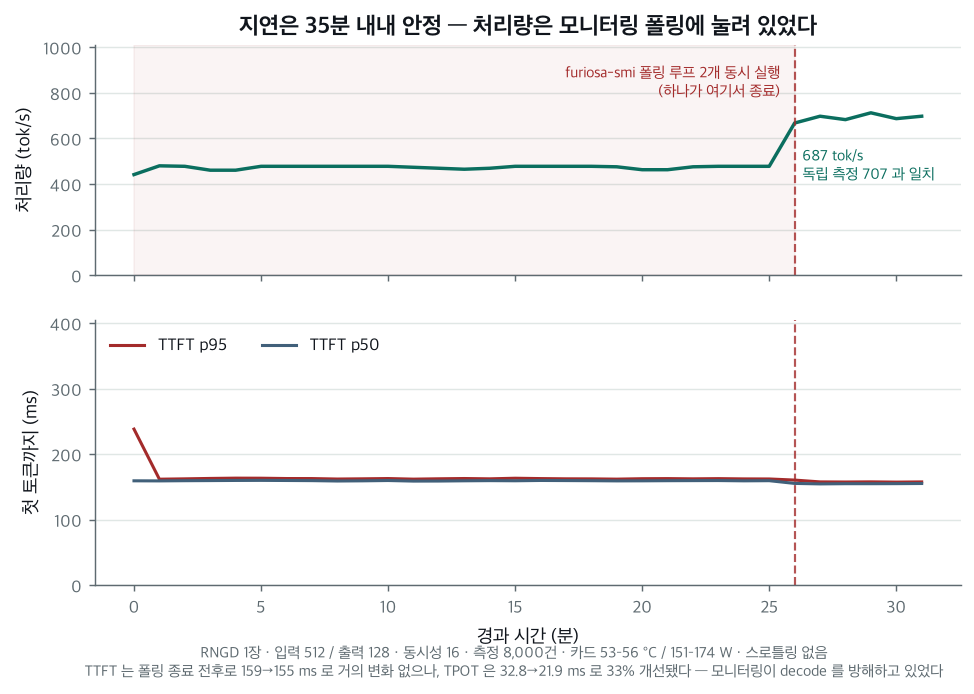
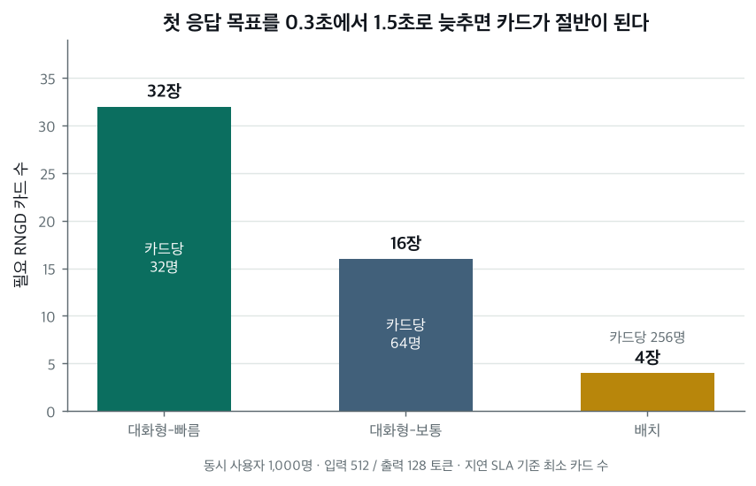
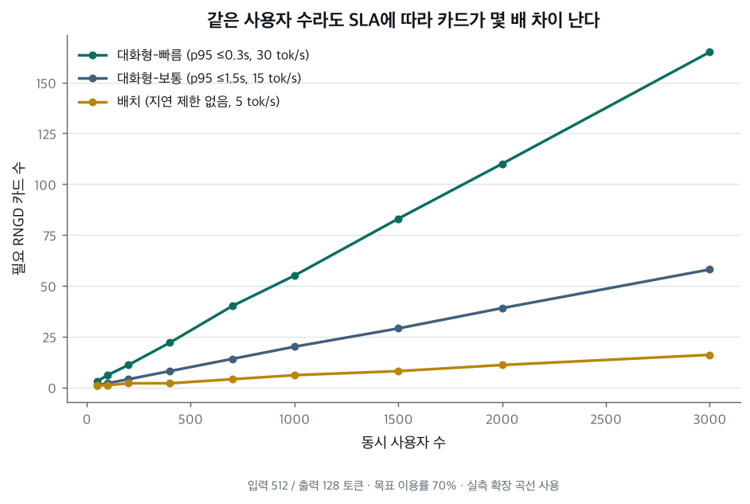

# rngd-workload-sizer

FuriosaAI RNGD NPU에서 실제 추론 워크로드를 측정하고, 그 실측값으로 **"이 서비스에 RNGD 몇 장이 필요한가"**에 답하는 도구입니다.

---

## 문제

서비스를 설계할 때 이런 질문을 받습니다.

> 동시 사용자 1,000명, 평균 입력 512토큰, 출력 128토큰, 첫 응답 1.5초 이내. NPU 몇 장이 필요한가?

카탈로그의 peak TOPS로는 답할 수 없습니다. 실제로 측정해보면 **용량을 결정하는 것이 연산 성능이 아니기 때문**입니다.

### 실측으로 확인한 세 가지

**1. Prefill 비용은 토큰 수에 비례하지 않고 계단형입니다.**

RNGD는 컴파일된 shape 단위로 실행됩니다. 입력 길이를 64토큰부터 촘촘히 훑은 결과:

| 입력 길이 | 첫 토큰까지(TTFT) |
|---|---|
| 64 – 96 | ~20 ms |
| 128 – 224 | ~26 ms |
| **256 – 1,004** | **~78 ms** |
| ~1,005 – 1,280 | ~95–105 ms |
| 1,536 – | ~156 ms |

**256토큰과 896토큰의 prefill 비용이 같습니다.** 3.5배의 길이 범위가 동일 비용입니다. 프롬프트가 300토큰이라면 few-shot 예시나 RAG 문맥을 **596토큰 더 붙여도 TTFT가 늘지 않습니다.**

반대로 경계를 넘으면 토큰 몇 개 차이로 비용이 뜁니다. 같은 측정 조건 안에서도 실제 프롬프트가 1,003토큰인 요청은 77 ms, 1,037토큰인 요청은 96 ms였습니다 — **+24%**.


FLOPS 계산으로는 이 계단이 보이지 않습니다.

**2. 최대 처리량 지점은 운영할 수 없는 지점입니다.**

RNGD 1장에서 동시 요청을 늘려가며 측정한 결과:

| 동시 요청 | 처리량 | 첫 토큰까지 p95 |
|---:|---:|---:|
| 32 | 1,066 tok/s | 252 ms |
| **64** | **1,213 tok/s** | **261 ms** |
| 128 | 1,459 tok/s | **5,324 ms** |
| 256 | 1,310 tok/s ↓ | 14,882 ms |

절벽이 64와 128 사이에 있습니다. 128로 올리면 처리량이 20% 늘지만 응답 대기가 **20배** 나빠지고, 256에서는 처리량이 **오히려 떨어지면서** 지연만 15초가 됩니다.


즉 **"최대 처리량 ÷ 사용자당 필요량"으로 계산하면 실제로는 못 쓰는 숫자가 나옵니다.** 용량은 SLA를 지키는 지점에서 세야 합니다.

**3. 카드를 N장 쓰면 성능도 N배라는 가정은 검증해야 합니다.**

이건 측정해보니 사실이었지만, 미리 알 수 있는 것은 아니었습니다. 카드를 늘리면 라우팅 오버헤드와 카드당 배치 감소가 동시에 일어나기 때문입니다.

| 카드당 동시성 | 2장 | 4장 | 8장 |
|---:|---:|---:|---:|
| 4 | 100.4% | 99.8% | 96.9% |
| 16 | 99.8% | 102.4% | 100.8% |
| 32 | 96.4% | 96.7% | **82.1%** |


중간 동시성에서는 8장까지 사실상 선형입니다. 카드당 동시성이 높을 때만 8장에서 82%로 떨어집니다. **효율이 카드 수만이 아니라 카드당 동시성에도 의존한다**는 것이 이 표의 요점입니다.

---

## 무엇을 만들었나

```
측정 하네스  →  실측 데이터  →  분석  →  용량 산정기  →  UI
benchmark/      data/          analysis/  planner/       app/
```

세 부분이 **완전히 분리**돼 있습니다. 측정은 계산을 모르고, 계산은 화면을 모릅니다. 실측 데이터가 유일한 인터페이스이므로, RNGD가 없어도 저장소를 받아 계산과 그래프를 그대로 재현할 수 있습니다.

| | |
|---|---|
| `benchmark/` | 측정 하네스. 표준 라이브러리만 사용 |
| `analysis/` | raw 측정 → 집계 테이블·확장 효율 |
| `planner/` | 용량 산정. 순수 함수, UI 의존 없음 |
| `app/` | Streamlit UI |
| `data/raw/` | 요청별 원본 (JSONL) |
| `docs/` | 환경 조사·기획 검토·측정 프로그램·세션 로그 |

---

## 어떻게 측정했나

측정이 이 프로젝트의 핵심입니다. **틀린 측정은 그럴듯한 숫자를 내기 때문에** 하네스가 스스로 신뢰도를 검증합니다.

### 측정 환경

| | |
|---|---|
| 하드웨어 | RNGD 8장, firmware `2026.3.0` |
| **1 RNGD 정의** | `--devices npu:X` = 카드 1장 = **PE 8개 전체** (TP=8) |
| SDK | `furiosa-llm 2026.3.0` |
| 모델 | `furiosa-ai/Qwen3-8B-FP8` |
| API 경로 | `/v1/completions` (chat 아님) |

### 측정 조건 통제

| 통제 | 이유 |
|---|---|
| `--no-enable-prefix-caching` | **기본값이 ON**이라 반복 측정이 오염됩니다 (아래 참조) |
| 요청마다 고유 난수 프롬프트 | 캐시 적중을 막습니다 |
| `/tokenize`로 길이 보정 | 문자 수 어림 금지. 서버 토크나이저 기준으로 목표 길이에 수렴시킵니다 |
| `ignore_eos` + `min_tokens` | 출력 길이를 정확히 고정. EOS가 들쭉날쭉하면 TPOT 비교가 무의미합니다 |
| 조건당 100건 이상 | 미달이면 P95를 내지 않고 `insufficient_samples`로 표기 |

### 지표 정의

```
TTFT = 첫 non-empty 토큰 delta 수신 시각 − 요청 전송 시각
E2E  = 마지막 delta 수신 시각 − 요청 전송 시각
TPOT = (E2E − TTFT) / (출력 토큰 수 − 1)

처리량 = Σ(측정 요청의 출력 토큰) / 측정 구간 wall-clock
```

wall-clock 기반 처리량과 요청별 지연을 **섞지 않습니다.**

동시성 N은 "N개를 보내고 다 끝나기를 기다린다"가 아니라 **"항상 N개가 처리 중"**입니다. 워커가 요청을 끝내면 곧바로 다음을 보냅니다. 앞의 방식은 매 배치 끝에서 동시성이 줄어 처리량을 과소평가합니다.

> ⚠️ **`content`만 보면 안 됩니다.** Qwen3·gpt-oss 같은 추론 모델은 `content`가 끝까지 빈 채 `reasoning` delta로만 토큰을 냅니다. 원래 정의를 그대로 썼다면 이런 모델에서 TTFT가 **영원히 측정되지 않았을 것**이고, 에러도 나지 않았을 것입니다.

### 자기검증

측정 조건마다 결과를 믿어도 되는지 점검하고 `summary.json`에 남깁니다. **검증에 실패해도 값을 지우지 않고 표시만 합니다.**

| 항목 | 확인 |
|---|---|
| prefix cache 오염 | 프롬프트 중 캐시에서 나온 **비율** (5% 초과 시 오염) |
| 출력 길이 | `ignore_eos`가 실제로 먹었는가 |
| 입력 길이 | 의도한 길이와의 편차 |
| 실제 동시성 | `/metrics`의 `running_samples` — 배칭인가 큐잉인가 |
| 재시도 | 커넥션 재수립이 지연에 영향을 줬는가 |
| 표본 수 | P95를 낼 수 있는가 |
| 출처 | 전용 서버 실측인가 |

---

## 측정이 틀렸던 네 가지 — 그리고 고친 방법

이 프로젝트에서 가장 시간을 쓴 부분입니다. **넷 다 그럴듯한 숫자를 냈기 때문에** 우연히 두 번 재보지 않았다면 그대로 결론이 됐을 것들입니다.

### 1. prefix cache가 긴 문맥에서 prefill을 최대 21배 과소평가

같은 프롬프트를 반복 측정하면 2회차부터 캐시가 적중합니다. 서버 기본값이 ON입니다.

| 프롬프트 토큰 | 같은 프롬프트 반복 | 매번 다른 프롬프트 | 과소평가 |
|---:|---:|---:|---:|
| ~1,000 | 55 ms | 163 ms | 3.0× |
| ~4,800 | 90 ms | 653 ms | 7.3× |
| ~19,300 | 166 ms | 3,464 ms | **20.9×** |

무서운 점은 **"여러 번 재서 중앙값을 쓴다"는 신뢰성 장치가 오히려 편향을 키운다**는 것입니다. 반복할수록 캐시가 더 잘 맞습니다.

→ 캐시 OFF + 요청별 고유 프롬프트 + 적중 비율 기록 후 초과 시 자동 무효 처리.

### 2. 측정창이 짧으면 처리량은 과소, 지연은 과대평가

같은 조건(1장, 입력 512, 동시성 32)을 두 번 측정한 결과:

| 측정 요청 | 측정창 | 처리량 | TTFT p95 |
|---:|---:|---:|---:|
| 100건 | 13.7 s | 936.8 tok/s | **1,437 ms** |
| 500건 | 60.0 s | 1,065.9 tok/s | **252 ms** |

짧은 창에서는 시작 시점에 요청이 한꺼번에 도착하는 램프업 구간이 표본의 큰 비율을 차지하고, 그 큐 대기가 p95를 지배합니다. 8장 측정에서는 창을 2.7초에서 14.7초로 늘리자 처리량이 **45% 증가**했습니다.

→ 데이터가 `window_s`를 함께 싣고, 같은 조건이 여러 번 측정됐으면 **창이 긴 쪽**을 채택합니다.

### 3. 다른 측정과 동시에 돌면 부하 생성기가 경합

카드가 달라도 부하 생성기가 호스트 자원을 나눠 쓰면서 처리량이 **707 → 521 tok/s (−26%)** 로 떨어졌습니다.

→ run 간 시간 겹침을 판정해 각 행에 `exclusive`를 기록하고, 근거를 고를 때 **신뢰 가능한 측정창 → 단독 실행 → 창 길이** 순으로 판정합니다.

이 순서가 중요합니다. 실제로 "단독이지만 창 12초(p95 3,070 ms)"와 "동시 실행이지만 창 63초(p95 261 ms)"가 충돌했는데, **짧은 창의 오염이 동시 실행 오염보다 큽니다.**

### 4. 지속 부하 도중 처리량이 계단으로 뛰었다 — 기전 미확인

35분 지속 부하 중 **26분 지점에서 처리량이 470 → 690 tok/s로 뛰었습니다.**

추적해보니 앞선 실행에서 남은 `furiosa-smi info` 폴링 루프가 죽지 않고 살아 있었고,
그 마지막 샘플 시각(`12:15:59`)이 전이 구간(25→26분)과 **정확히 일치**했습니다.
10초 간격 폴링 루프 **두 개**가 동시에 돌다가 하나가 끝난 시점입니다.

| | 폴링 2개 | 폴링 1개 | 폴링 0개 (독립 측정) |
|---|---:|---:|---:|
| TTFT p50 | 159 ms | 155 ms | — |
| **TPOT p50** | **32.8 ms** | **21.9 ms** | — |
| 처리량 | 475 tok/s | 687 tok/s | **707 tok/s** |

첫 토큰까지는 거의 그대로인데 **토큰 간 간격만 33% 개선**됐습니다. prefill이 아니라
decode 쪽에서 무언가가 풀린 것입니다. 전이 후 값은 독립 측정(C2x1, 동시성 16, 단독 실행)과
**2.9% 안에서 일치**합니다.



**그런데 "폴링이 원인"이라고 단정하지 않습니다.** 교차검증에서 두 가지가 맞지 않는다는
지적이 나왔고, 타당합니다.

- **용량-반응이 선형이 아닙니다.** 폴러 0→1개는 −2.9%인데 1→2개는 −32.8%입니다.
  두 번째 폴러의 비용이 첫 번째의 11배입니다. 락 경합이면 비선형이 자연스럽지만,
  그건 가설이지 확인된 기전이 아닙니다.
- **전력 신호가 없습니다.** 전이 전 151–174 W, 후 159–174 W로 육안상 차이가 없습니다.
  카드가 33% 더 일하게 됐는데 전력이 그대로인 것은 "PE가 대기하고 있었다"와 잘 맞지 않습니다.
  10초 간격 ±10 W 산포에 가려졌을 수도 있습니다.

현재까지 말할 수 있는 것은 **"폴링 종료와 시각이 정확히 일치하나 기전은 미확인"** 까지입니다.
결정적 시험은 쌉니다 — 같은 조건에서 폴러 0/1/2개로 각 3분씩 재면 10분입니다.
다음 세션 과제로 넣었습니다.

**확인 여부와 무관하게 지킬 것**

- 처리량이 목적인 측정에서는 폴링을 끄거나 간격을 늘리고, 폴링 주기를 결과에 기록합니다
- **백그라운드로 띄운 것은 종료를 확인합니다.** 죽은 줄 알았던 루프가 33분 더 살아 있었습니다
- 이 run의 **절대 처리량은 인용하지 않습니다.** 안정성(TTFT 평탄, 스로틀링 없음) 결론만 씁니다

---

## 용량 계산 방식

지연 제약과 처리량 제약을 **따로 계산하고 더 큰 쪽**을 택합니다. 처리량만 만족하면 "충분하다"고 하지 않습니다.

### 지연 제약

```
C_max = SLA(TTFT p95, 사용자당 출력 속도, 요청 완료 p95)를 만족하는
        최대 카드당 동시성
n_by_latency = ceil(동시 사용자 / C_max)
```

### 처리량 제약 — 순환 의존을 고정점 반복으로

카드당 처리량은 카드당 동시성에 따라 달라지는데, 카드당 동시성은 카드 수가 정해져야 나옵니다. 그래서 반복해서 수렴시킵니다.

```
n := 1
반복:
    카드당 동시성  := ceil(동시 사용자 / n)
    실측 행       := 그 동시성의 측정 (없으면 보간)
    확장 효율     := 실측 곡선에서 조회 (카드 수 + 카드당 동시성 기준)
    카드당 가용   := 실측 처리량 × 확장 효율 × target_utilization
    n_new        := ceil(필요 처리량 / 카드당 가용)
    수렴하면 종료
```

`target_utilization`은 **분모에 한 번만** 적용합니다. `headroom`으로 입력받으면 `1 − headroom`으로 변환해 들어오고 그 외 어디에도 곱하지 않습니다.

### 최종

```
필요 카드 = max(n_by_latency, n_by_throughput)
```

어느 쪽이 결정했는지(`binding_constraint`)를 함께 출력합니다.

### 결과에 함께 나오는 것

| 출력 | 내용 |
|---|---|
| 근거 측정 | 어느 run의 어느 조건을 썼는지 (`run_id`, 표본 수, 측정창) |
| 신뢰도 | `measured` / `interpolated` / `interpolated_across_bucket_boundary` / `extrapolated` |
| 반복 과정 | 고정점 반복의 각 회차 |
| 예상 병목 | 규칙에 맞지 않으면 **`unknown`을 그대로** 출력 |
| **SLA 완화의 대가** | "TTFT 목표를 2배 늦추면 카드 N장 절약" |
| 경고 | 버킷 경계 보간, 짧은 측정창, 동시 실행, 격자 상한, 표본 부족 |

**SLA 완화의 대가**가 이 도구를 계산기에서 의사결정 도구로 만드는 부분입니다. 동시 사용자 1,000명 기준:

| SLA 등급 | 조건 | 카드당 | 필요 카드 |
|---|---|---:|---:|
| 대화형-빠름 | TTFT p95 ≤0.3s, 사용자당 ≥30 tok/s | 32명 | **32장** |
| 대화형-보통 | TTFT p95 ≤1.5s, 사용자당 ≥15 tok/s | 64명 | **16장** |
| 배치 | TTFT 제한 없음, 사용자당 ≥5 tok/s | 128명 | **4장** |



첫 응답 목표를 0.3초에서 1.5초로 늦추면 **카드가 절반**이 됩니다. 사용자 수가 늘수록 이 차이는 그대로 배수로 벌어집니다.



### 데이터 출처 게이팅

용량 계산에 쓸 수 있는 것은 **전용 서버 실측뿐**입니다.

개발 중에는 FuriosaAI 호스팅 엔드포인트로 하네스를 검증했는데, 이 데이터는 카드 수를 알 수 없고 멀티테넌트이며 관측 지연의 99%가 네트워크입니다. 사람이 실수로 섞는 것을 막기 위해 모든 측정에 출처 태그를 강제로 박고, **산정기가 읽는 단계에서 거부**합니다. 합성 데이터도 명시적으로 허용해야만 들어오고, 들어오면 결과에 경고가 붙습니다.

---

## 주요 관찰

측정으로 확인한 것들입니다. 확인하지 못한 것은 [한계](#한계)에 적었습니다.

**Prefill이 계단형이라는 것이 서비스 설계에 직접 쓰입니다.** 256–1,004토큰 구간이 동일 비용이므로, 이 범위 안에서는 프롬프트를 늘려도 첫 응답이 느려지지 않습니다. 반대로 1,004토큰을 몇 개 넘기면 +24%를 물게 됩니다. 산정기가 이 경계를 알고 있어서, 입력 길이가 경계 바로 위면 "조금 줄이면 같은 비용"이라고 알려줍니다.

**용량은 처리량이 아니라 응답 지연에 먼저 막힙니다.** 최대 처리량(1,459 tok/s)에서 TTFT p95는 5.3초입니다. 대화형 서비스라면 쓸 수 없는 값입니다. 실제 운영점은 동시성 64(1,213 tok/s, p95 261 ms)이고, 여기서 처리량의 83%를 씁니다.

**동시성을 더 올리면 처리량이 떨어지는 구간이 있습니다.** 동시성 256은 128보다 처리량이 낮고(1,310 vs 1,459) 지연은 3배 나쁩니다. 모든 면에서 열등하므로 운영점 후보가 아닙니다. 산정기가 "동시성 최대"가 아니라 "SLA 안에서 처리량 최대"를 고르는 이유입니다.

**35분 지속 부하에서 지연이 유지됩니다.** 운영점(동시성 16)에서 8,000건을 연속 처리하는 동안 TTFT p50 159 ms / p95 162 ms로 거의 미동이 없었고, 카드 온도 53–56 °C, 전력 151–174 W, **스로틀링 기록 없음**. 짧은 벤치에서 잰 값을 지속 가능한 값으로 볼 수 있다는 근거입니다.

단, 이 실행의 **절대 처리량은 인용하지 않습니다.** 26분 지점에서 계단으로 뛰었고 그 기전이 확인되지 않았습니다(위 4번). 전이 후 687 tok/s가 독립 측정 707 tok/s와 2.9% 차이로, 그쪽이 방해받지 않은 값으로 보입니다.

> 하드웨어 해석에 대해: 이 프로젝트는 관측된 성능 패턴을 기록하되, 그 원인을 단정하지 않습니다. HBM 대역폭 카운터에 접근할 수 없어 "memory-bound"라고 말할 근거가 없고, "peak FLOPS 대비 낮으니 비효율적"이라는 식의 결론도 내지 않습니다. 병목 판정은 관측 가능한 지표(KV 캐시 사용률, 대기열, 처리량 포화 패턴)에서 나오는 규칙으로만 하고, 규칙에 맞지 않으면 `unknown`으로 둡니다.

---

## 한계

**측정 범위**
- 모델 1종(`Qwen3-8B-FP8`)만 측정했습니다. 다른 크기·구조의 모델은 다를 수 있습니다
- 입력 길이 512 기준으로만 고동시성 구간을 측정했습니다. 1,024·2,048에서는 동시성 32까지만 긴 측정창으로 측정했으므로, **긴 입력에서 절벽이 어디인지 모릅니다**
- Embedding 워크로드는 측정하지 못했습니다 (하네스는 완성)

**데이터 신뢰도**
- 동시성 64·128·256의 근거는 **다른 측정과 동시에 실행된 것**입니다. 절벽 위치(64↔128)라는 결론은 20배 차이라 뒤집히지 않겠지만, 절대 수치는 단독 재측정이 필요합니다
- 8장·카드당 동시성 32의 효율 82.1%는 측정창이 14.6초로 비교군 중 가장 짧습니다

**측정하지 않은 것**
- **혼합 부하 간섭** — 실제 서비스는 prefill과 decode가 섞여 들어옵니다. 긴 문서 하나가 들어올 때 다른 사용자 응답이 얼마나 느려지는지 측정하지 않았습니다
- KV 캐시 포화점 — 카드당 상한이 263,329토큰이라는 것은 알지만 실제로 어디서 대기열이 생기는지 확인하지 않았습니다

**구조적 가정**
- 카드 확장은 data parallel(모델 복제)만 측정했습니다. 한 장에 안 올라가는 모델의 tensor/pipeline parallel은 다른 문제입니다
- 산정기는 실측 격자를 보간합니다. 격자 밖은 외삽으로 표시하고 신뢰도를 낮추지만, 그래도 외삽입니다

---

## 실행 방법

### 용량 산정 (RNGD 불필요)

측정 데이터가 저장소에 포함돼 있어 NPU 없이 그대로 재현됩니다.

```bash
python -m analysis.process              # raw 측정 → 집계 테이블

python -m venv .venv && .venv/bin/pip install matplotlib
.venv/bin/python -m analysis.plots      # 그래프 재생성 → analysis/plots/
```

```python
import json
from planner.benchmark_store import BenchmarkStore
from planner.models import BenchmarkRow, ServiceRequirement
from planner.capacity import plan, format_result

rows = [BenchmarkRow(**{k: v for k, v in d.items()
                        if k in BenchmarkRow.__dataclass_fields__})
        for d in json.load(open("data/processed/benchmark_rows.json"))["rows"]]

print(format_result(plan(BenchmarkStore(rows), ServiceRequirement(
    workload="llm_chat", model="furiosa-ai/Qwen3-8B-FP8",
    concurrent_users=1000, avg_input_tokens=512, avg_output_tokens=128,
    target_output_tps_per_user=15.0, target_max_ttft_ms=1500.0,
    target_utilization=0.7))))
```

> Streamlit UI(`app/`)는 아직 작성 중입니다. 현재는 위와 같이 `planner`를 직접 호출합니다.

### 벤치마크 (RNGD 필요)

```bash
# 1. 서버 기동 — 카드 1장, prefix cache OFF
furiosa-llm serve furiosa-ai/Qwen3-8B-FP8 \
  --devices npu:0 --host 127.0.0.1 --port 8000 --no-enable-prefix-caching

# 2. 측정
python -m benchmark.run_llm --target local \
  --model furiosa-ai/Qwen3-8B-FP8 --base-url http://127.0.0.1:8000/v1 \
  --config benchmark/configs/b1_sla_frontier.json --cards 1 --devices npu:0
```

`--scale 0.1` 로 요청 수를 줄여 짧게 확인할 수 있습니다.

### 테스트

```bash
python -m pytest tests/ -q
```

### 실험 구성

| config | 목적 |
|---|---|
| `a3_bucket_scan.json` | prefill 계단 구조 스캔 |
| `a4_boundary_zoom.json` | 버킷 경계 정밀 특정 |
| `b1_sla_frontier.json` | 입력 길이 × 동시성 격자 (용량 산정의 원천) |
| `c1_scaling.json` | 카드 확장 효율 |
| `d1_embedding.json` | Embedding 처리량 |

---

## 현재 상태

| | |
|---|---|
| 측정 하네스 | ✅ 테스트 137건 |
| 실측 데이터 (8B) | 🟡 고동시성 3점 재측정 필요 |
| 실측 데이터 (Embedding·32B) | ❌ 미측정 |
| 용량 산정기 | ✅ |
| 그래프 | ✅ 6종 |
| UI | ❌ 작성 중 |

진행 상황은 [docs/STATUS.md](docs/STATUS.md)에서 갱신합니다.

## 문서

| | |
|---|---|
| [00-environment.md](docs/00-environment.md) | 실측 환경 조사 — SDK·모델·아티팩트 버킷 구조 |
| [01-spec-review.md](docs/01-spec-review.md) | 착수 전 설계 검토 (Critical 5 / Important 12) |
| [03-api-findings.md](docs/03-api-findings.md) | API 동작 확인 — 하네스 설계를 바꾼 발견들 |
| [02-plan.md](docs/02-plan.md) | 측정 정의·데이터 스키마·용량 수식 (실험 목록은 04로 대체) |
| [04-experiment-program.md](docs/04-experiment-program.md) | 측정 프로그램 설계 |
| [05-session-1-log.md](docs/05-session-1-log.md) | 실측 세션 전체 기록 (실패 포함) |
